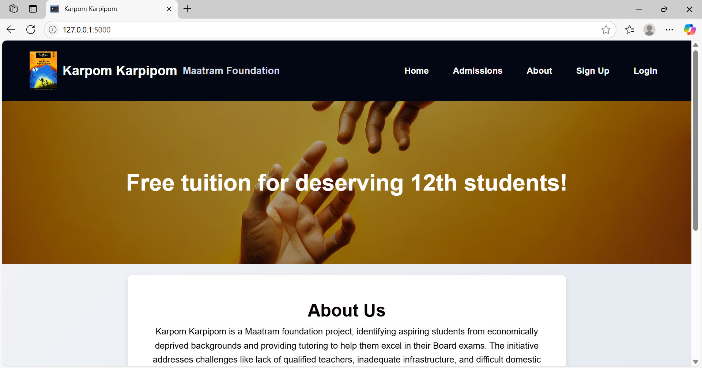

# 🎓 Volunteer-Run Free Tuition Centre Management System

This is a web application built to support a **non-profit, volunteer-run tuition center** that provides **free education** to underprivileged students. The system streamlines operations for **admins**, **students**, **tutors**, and **volunteers**. Designed with role-based access control, it ensures every stakeholder can access or manage only the relevant data.

## 💡 Purpose

To simplify and digitize the daily functioning of our **free tuition NGO**, empowering our team of **volunteers and tutors** to focus on teaching, mentoring, and managing student progress with ease.

## 📌 Key Features

### 👨‍🎓 Student
- Applies for tuition 
- View attendance
- Check test marks and feedback
- View assignment status
- Update personal info

### 👨‍🏫 Tutor (Volunteer)
- Marks attendance for assigned students
- Tracks student progress

### 🧪 Test Volunteer
- Enters test marks after assessments

### 📝 Assignment Volunteer
- Uploads assignments based on syllabus coverage
- Tracks which students completed assignments

## 🧱 Tech Stack

| Layer     | Technology         |
|-----------|--------------------|
| Backend   | Python (Flask)     |
| Database  | MySQL              |
| Frontend  | HTML, CSS, JavaScript |
| Templates | Jinja2             |

## 📬 Future Plans

Fee payment tracking (if needed for other branches)

SMS/email alerts for test results and attendance

Upload/download feature for assignments

